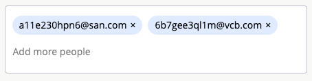

# Emils Input Component



A simple js component, which provides you such features:
- clipboard paste of multiple emails
- insertion of an email via enter, comma keys or focusout event
- removal of last email via backspace key
- highlighting of invalid emails
- simple API
- no jQuery dependency
- support of IE 11

[Demo](https://curpeng.github.io/emails-component/)

### How to use

1. Include js and css file into your page

```
<script src="docs/components.abbc97bf.js"></script>
<link rel="stylesheet" href="docs/emails_input.6ae5d982.css" />
```

2. build instance of the component

```
<script>
  var inputContainerNode = document.querySelector('#emails-input');
  var emailsInput = new EmailsInput(inputContainerNode, {...options});
</script>
```

If you want to subscribe on changes you can do:

```
  var emailsInput = new EmailsInput(inputContainerNode, {onChange: (emails) => { console.log(emails) } });
```

The constuctor accepts such options:
  - placeholder: String,
  - onChange: Function

### API
- `emails({onlyValid: true})` - returns valid emails
- `setEmails(['email@gmail.com'])` - populates provided emails
- `addEmail('hello@yahoo.com')` - adds proved email

### To run locally

- type in the terminal:
```
  yarn install
  yarn start
```

- open http://localhost:3000 in the browser

### To release a new version of the demo page

- run `yarn build`
- commit changes
- merge to master branch
